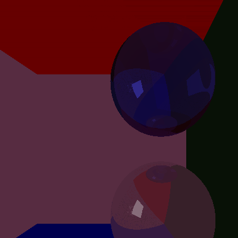

# RustRayTracer2

A simple rust ray tracer... It is more powerfull than my previous one yet slower. 

TODO:
  - make bitmap textures or similar work 
  - implement cylinders and curves
  - implement texture functions
  - clean up code
  - implement depth of field
  
 all contributions are welcome

Results:

